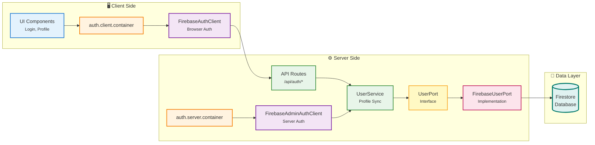
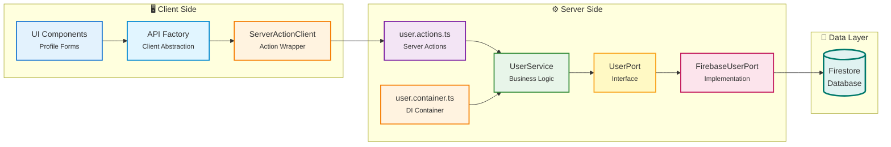

# DevSnippets

A Next.js application for storing, organizing, and sharing reusable code snippets across technologies.

## Stack

- Next.js 16
- React 19
- TypeScript
- Firebase Auth + Firestore
- Vitest for script-driven integration tests
- App Router (`src/app`)

## Quick Start

```bash
pnpm install
pnpm dev
```

Open `http://localhost:3000`.

Note: `pnpm dev` runs `pnpm code:fix` first (format + organize imports).

## Architecture Summary

The project follows a feature-first hexagonal architecture.

```text
UI -> API Client/Action -> Service -> Repository -> Firestore
```

Key design points:

- Business rules live in feature services.
- Persistence logic lives in repository implementations.
- Environment-specific wiring lives in client/server containers.
- API factories enable migration from `serverless` to `rest`/`graphql` modes.

## Test and Script Commands

```bash
pnpm test
pnpm test:auth
pnpm test:user
pnpm test:snippet
pnpm test:database
pnpm test:all
```

```bash
pnpm tools:clear
pnpm tools:seed
pnpm tools:auth
pnpm tools:user
pnpm tools:snippet
```

## Documentation

- `docs/ARCHITECTURE_PATTERN.md`
- `docs/API_MIGRATION.md`
- `docs/FIREBASE_CONFIG.md`
- `scripts/README.md`

## Environment Variables

Required Firebase and optional service variables are documented in `docs/FIREBASE_CONFIG.md`.

## SEO

The app includes per-page metadata, `metadataBase`, `robots.ts`, and `sitemap.ts` to improve discoverability.

## Feature Architecture

Each feature follows hexagonal architecture with swappable layers:

### Auth Feature



**Layers:**
- **UI**: Client components, hooks (useAuth)
- **Container**: Environment-based DI (client/server)
- **Port**: AuthPort interface (swappable contract)
- **Adapter**: Firebase/Auth0/Custom implementations
- **API**: Session management routes
- **Service**: User profile sync
- **Repository**: User persistence

---

### User Feature



**Layers:**
- **UI**: Profile forms, user cards
- **API Client**: Server action wrapper
- **Actions**: Server actions (auth + validation)
- **Service**: Business rules (username validation, uniqueness)
- **Port**: UserPort interface for user persistence
- **Port Impl**: Firebase/PostgreSQL/MongoDB

---

### Snippet Feature

```mermaid
flowchart LR
    subgraph Client["🖥️ Client Side"]
        UI["UI Components<br/><small>Forms, Cards, Viewer</small>"]
        APIFactory["API Factory<br/><small>Client Abstraction</small>"]
        ServerActionClient["ServerActionClient<br/><small>Action Wrapper</small>"]
    end
    
    subgraph Server["⚙️ Server Side"]
        Actions["snippet.actions.ts<br/><small>Server Actions</small>"]
        Container["snippet.server.container<br/><small>DI Container</small>"]
        Service["SnippetService<br/><small>Business Logic</small>"]
        Port["SnippetPort<br/><small>Interface</small>"]
        Adapter["SnippetPortAdapter<br/><small>Read/Write Router</small>"]
        Repo["SnippetRepository<br/><small>Read Operations</small>"]
        FirebaseRepo["FirebaseSnippetRepository<br/><small>Implementation</small>"]
    end
    
    subgraph Data["💾 Data Layer"]
        Firestore[("Firestore<br/>Database")]
    end
    
    UI --> APIFactory
    APIFactory --> ServerActionClient
    ServerActionClient --> Actions
    Container --> Service
    Service --> Port
    Port --> Adapter
    Adapter -->|Writes| Actions
    Adapter -->|Reads| Repo
    Repo --> FirebaseRepo
    FirebaseRepo --> Firestore
    Actions -.->|Auth Check| Service
    
    style UI fill:#e3f2fd,stroke:#1976d2,stroke-width:2px
    style APIFactory fill:#e1f5ff,stroke:#0288d1,stroke-width:2px
    style ServerActionClient fill:#fff3e0,stroke:#f57c00,stroke-width:2px
    style Actions fill:#f3e5f5,stroke:#7b1fa2,stroke-width:2px
    style Container fill:#fff3e0,stroke:#f57c00,stroke-width:2px
    style Service fill:#e8f5e9,stroke:#388e3c,stroke-width:2px
    style Port fill:#fff9c4,stroke:#f9a825,stroke-width:2px
    style Adapter fill:#ede7f6,stroke:#5e35b1,stroke-width:2px
    style Repo fill:#fce4ec,stroke:#c2185b,stroke-width:2px
    style FirebaseRepo fill:#fce4ec,stroke:#c2185b,stroke-width:2px
    style Firestore fill:#e0f2f1,stroke:#00796b,stroke-width:3px
```



**Layers:**
- **UI**: Snippet forms, cards, viewer, code editor
- **API Client**: Server action wrapper
- **Actions**: Server actions (auth + ownership checks)
- **Service**: Business rules (versioning, sharing, soft delete)
- **Port**: SnippetPort interface
- **Adapter**: Routes reads to repo, writes to actions
- **Repository**: Firebase/PostgreSQL/MongoDB

---

## Architecture Strengths

✅ **Clean separation** - Each layer has single responsibility  
✅ **Swappable adapters** - Easy to migrate Firebase → PostgreSQL  
✅ **Environment-aware** - Client/server containers prevent leaks  
✅ **Testable** - Scripts use same services as production  
✅ **Type-safe** - Strong TypeScript contracts at boundaries

## Notes

- Package manager: `pnpm`
- Script safety guard requires `FIREBASE_PROJECT_ID=dev-snippets-dev` for destructive script operations
