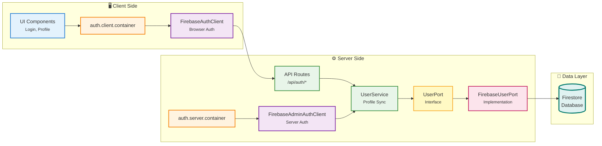
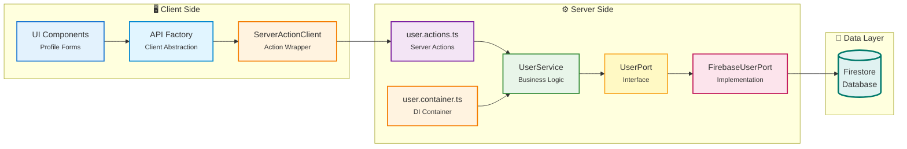

# DevSnippets

A Next.js application for storing, organizing, and sharing reusable code snippets across technologies.

## Stack

- Next.js 16
- React 19
- TypeScript
- Firebase Auth + Firestore
- CodeMirror 6 (Code Editor)
- jszip (Multi-file export)
- Vitest for script-driven integration tests
- App Router (`src/app`)

## Quick Start

```bash
pnpm install
pnpm dev
```

Open `http://localhost:3000`.

Note: `pnpm dev` runs `pnpm code:fix` first (format + organize imports).

## Key Features

### Multi-File Snippets
- Store multiple code files in a single snippet
- Each file has its own language, filename, and code
- Automatic language detection on paste
- Per-file and global export (ZIP archive for multiple files)
- File tabs with keyboard navigation (Ctrl+Shift+Left/Right)
- Add new files with Ctrl+Alt+N
- Maximum 10 files per snippet, 50 character filename limit

### Code Editor
- Syntax highlighting with CodeMirror 6
- Real-time code formatting with language-specific formatters
- Language auto-detection from pasted code
- Keyboard shortcuts (Shift+Alt+F to format, Ctrl+S to save)
- Centered loading indicator during formatting and language detection
- Error display with collapsible accordion
- Undo/Redo support

### UI/UX Improvements
- Responsive design (mobile-first)
- Dark mode support
- Skeleton loaders for better perceived performance
- Toast notifications for user feedback
- Improved file tabs styling with active state highlighting
- Format button with label on desktop, icon-only on mobile

## Keyboard Shortcuts

**File Management:**
- `Ctrl+Alt+N` / `Cmd+Alt+N` - Add new file
- `Ctrl+Alt+D` / `Cmd+Alt+D` - Delete current file
- `Ctrl+Shift+Right` / `Cmd+Shift+Right` - Next file tab
- `Ctrl+Shift+Left` / `Cmd+Shift+Left` - Previous file tab

**Code Editor:**
- `Shift+Alt+F` - Format code
- `Ctrl+S` / `Cmd+S` - Save snippet
- `Ctrl+Shift+/` / `Cmd+Shift+/` - Show editor shortcuts
- `Ctrl+Z` / `Cmd+Z` - Undo
- `Ctrl+Y` / `Cmd+Y` - Redo

## Architecture Summary

The project follows a feature-first hexagonal architecture.

```text
UI -> API Client/Action -> Service -> Repository -> Firestore
```

Key design points:

- Business rules live in feature services.
- Persistence logic lives in repository implementations.
- Environment-specific wiring lives in client/server containers.
- API factories enable migration from `serverless` to `rest`/`graphql` modes.

## Testing

Three test layers exist in this repo:

- `pnpm test` runs fast unit-style tests and does not call live Firebase.
- `pnpm test:formatter:integration` calls the real formatter microservice.
- `pnpm test:firebase` runs live Firebase integration tests against the dev project.
- `pnpm test:firebase:all` runs the combined scripted Firebase smoke flow.

Useful commands:

```bash
pnpm test
pnpm test:formatter:integration
pnpm test:firebase
pnpm test:firebase:all
pnpm test:auth
pnpm test:user
pnpm test:snippet
pnpm test:database
pnpm test:all
```

Formatter integration tests require a reachable formatter service and valid formatter service credentials.
Firebase integration tests require valid Firebase environment variables and a reachable dev Firebase project.

## Test Tools

```bash
pnpm tools:clear
pnpm tools:seed
pnpm tools:auth
pnpm tools:user
pnpm tools:snippet
```

## CI

GitHub Actions runs the pipeline in this order:

- `pnpm lint`
- `pnpm typecheck`
- `pnpm test`
- `pnpm test:formatter:integration` when formatter service secrets are configured
- `pnpm test:firebase` when Firebase secrets are configured
- `pnpm build`

## Documentation

- `docs/ARCHITECTURE_PATTERN.md` - Detailed hexagonal architecture patterns and layer responsibilities
- `docs/FIREBASE_CONFIG.md` - Firebase setup, environment variables, and troubleshooting
- `docs/FEATURE_GUIDE.md` - Guide for creating new features following the architecture
- `docs/SNIPPET_FEATURE.md` - Deep dive into the Snippet feature (versioning, sharing, soft delete)
- `docs/ERROR_HANDLING.md` - Error handling patterns and standardization
- `docs/QUICK_REFERENCE.md` - Quick reference guide for common tasks
- `scripts/README.md` - Script architecture and test execution model

## Environment Variables

Required Firebase and optional service variables are documented in `docs/FIREBASE_CONFIG.md`.

## SEO

The app includes per-page metadata, `metadataBase`, `robots.ts`, and `sitemap.ts` to improve discoverability.

## Feature Architecture

Each feature follows hexagonal architecture with swappable layers:

### Auth Feature



**Layers:**
- **UI**: Client components, hooks (useAuth)
- **Container**: Environment-based DI (client/server)
- **Port**: AuthPort interface (swappable contract)
- **Adapter**: Firebase/Auth0/Custom implementations
- **API**: Session management routes
- **Service**: User profile sync
- **Repository**: User persistence

---

### User Feature



**Layers:**
- **UI**: Profile forms, user cards
- **API Client**: Server action wrapper
- **Actions**: Server actions (auth + validation)
- **Service**: Business rules (username validation, uniqueness)
- **Port**: UserPort interface for user persistence
- **Port Impl**: Firebase/PostgreSQL/MongoDB

---

### Snippet Feature

```mermaid
flowchart LR
    subgraph Client["🖥️ Client Side"]
        UI["UI Components<br/><small>Forms, Cards, Viewer</small>"]
        APIFactory["API Factory<br/><small>Client Abstraction</small>"]
        ServerActionClient["ServerActionClient<br/><small>Action Wrapper</small>"]
    end
    
    subgraph Server["⚙️ Server Side"]
        Actions["snippet.actions.ts<br/><small>Server Actions</small>"]
        Container["snippet.server.container<br/><small>DI Container</small>"]
        Service["SnippetService<br/><small>Business Logic</small>"]
        Port["SnippetPort<br/><small>Interface</small>"]
        Adapter["SnippetPortAdapter<br/><small>Read/Write Router</small>"]
        Repo["SnippetRepository<br/><small>Read Operations</small>"]
        FirebaseRepo["FirebaseSnippetRepository<br/><small>Implementation</small>"]
    end
    
    subgraph Data["💾 Data Layer"]
        Firestore[("Firestore<br/>Database")]
    end
    
    UI --> APIFactory
    APIFactory --> ServerActionClient
    ServerActionClient --> Actions
    Container --> Service
    Service --> Port
    Port --> Adapter
    Adapter -->|Writes| Actions
    Adapter -->|Reads| Repo
    Repo --> FirebaseRepo
    FirebaseRepo --> Firestore
    Actions -.->|Auth Check| Service
    
    style UI fill:#e3f2fd,stroke:#1976d2,stroke-width:2px
    style APIFactory fill:#e1f5ff,stroke:#0288d1,stroke-width:2px
    style ServerActionClient fill:#fff3e0,stroke:#f57c00,stroke-width:2px
    style Actions fill:#f3e5f5,stroke:#7b1fa2,stroke-width:2px
    style Container fill:#fff3e0,stroke:#f57c00,stroke-width:2px
    style Service fill:#e8f5e9,stroke:#388e3c,stroke-width:2px
    style Port fill:#fff9c4,stroke:#f9a825,stroke-width:2px
    style Adapter fill:#ede7f6,stroke:#5e35b1,stroke-width:2px
    style Repo fill:#fce4ec,stroke:#c2185b,stroke-width:2px
    style FirebaseRepo fill:#fce4ec,stroke:#c2185b,stroke-width:2px
    style Firestore fill:#e0f2f1,stroke:#00796b,stroke-width:3px
```



**Layers:**
- **UI**: Snippet forms, cards, viewer, code editor
- **API Client**: Server action wrapper
- **Actions**: Server actions (auth + ownership checks)
- **Service**: Business rules (versioning, sharing, soft delete)
- **Port**: SnippetPort interface
- **Adapter**: Routes reads to repo, writes to actions
- **Repository**: Firebase/PostgreSQL/MongoDB

---

## Architecture Strengths

✅ **Clean separation** - Each layer has single responsibility  
✅ **Swappable adapters** - Easy to migrate Firebase → PostgreSQL  
✅ **Environment-aware** - Client/server containers prevent leaks  
✅ **Testable** - Scripts use same services as production  
✅ **Type-safe** - Strong TypeScript contracts at boundaries

## Notes

- Package manager: `pnpm`
- Script safety guard requires `FIREBASE_PROJECT_ID=dev-snippets-dev` for destructive script operations
